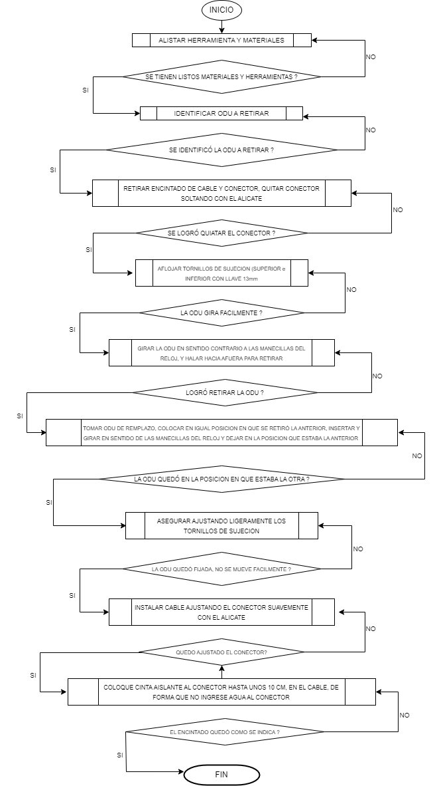

Proceso de Trabajo: CAMBIO DE ODU EN RADIO SIAE
- INICIO
- alistar herramienta y materiales (llave fija n. 13, alicates, cinta aislante, odu de remplazo)
- identificar odu a retirar (1 O 2)
-retirar encintado del cable Y conector y soltar conector aflojando con el alicate
- Aflojar tornillos de sujecion (parte superior e inferior) con llave 13mm.
- girar odu en sentido contrario a las manecillas del reloj y  halar odu hacia afuera para retirar
- tomar odu de remplazo, ubicar en igual posicion en que se retiró la anterior, insertar y girar en sentido de las manecillas del reloj y dejar en la posición que estaba la anterior.
- Asegurar ajustando ligeramente tornillos de sujecion, (superior e inferior) con llave 13
-Instalar cable y conector retirados, ajustande el conector suavemente con el alicate, protejer conector con cinta aislante
-FIN DEL PROCESO

